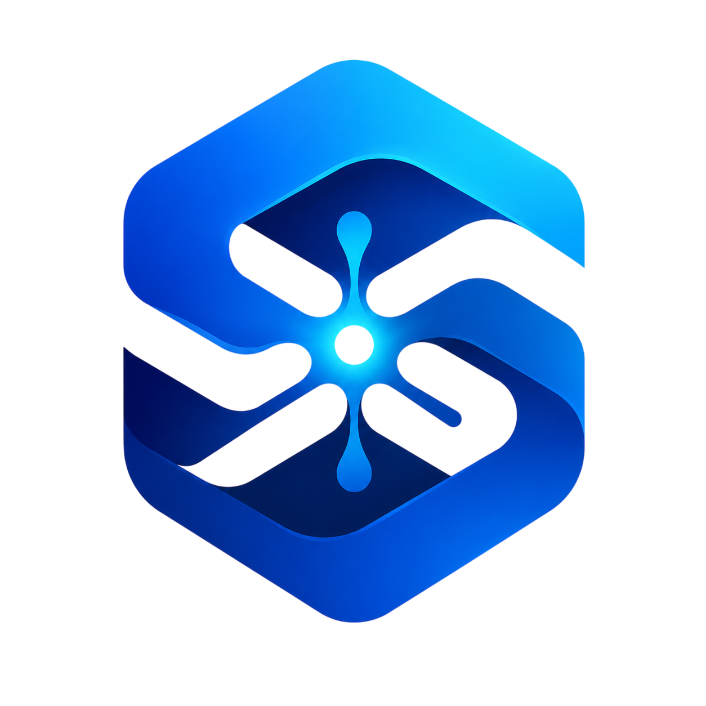

<p align="center">
  
</p>

<h1 align="center">Synapse Vault</h1>

<p align="center"><b>The Walrus-native autonomous treasury — memory, artifacts, and multi-agent coordination in every tick.</b></p>
<p align="center"><i>Hire an AI portfolio manager. Pay it in basis points. Revoke it in one click.<br>Every decision is recalled from MemWal, reasoned over, executed under Move policy, attested on-chain, and stored on Walrus.</i></p>

<p align="center">
  <a href="https://synapse-kappa-sable.vercel.app">Live demo</a> ·
  <a href="https://www.youtube.com/watch?v=R2g5HCLmApI">Demo video</a> ·
  <a href="https://www.youtube.com/watch?v=GbzpgDedcWU">Attestation</a> ·
  <a href="https://github.com/SuyashAlphaC/Synapse">Code</a> ·
  Sui Overflow 2026 · <strong>Walrus Track</strong>
</p>

---

Built for **Sui Overflow 2026 — Walrus Track**.

- **Judge summary:** [SUBMISSION.md](./SUBMISSION.md) — one-page executive brief
- **Demo video:** [YouTube (~7 min)](https://www.youtube.com/watch?v=R2g5HCLmApI) — live vaults, Walrus artifacts, MemWal recall, inspector, coordination
- **Attestation addendum:** [YouTube (~90 sec)](https://www.youtube.com/watch?v=GbzpgDedcWU) — Nautilus Policy, hosted runtime, Suiscan proof
- **Code:** this repo (Move + TypeScript SDK + Next.js dashboard + headless runtime)
- **Marketing site (Walrus Sites, testnet):** Site object `0x55c33a39757a4487ca8cebdaffd5b7b9f9ba9601456a82ef5f031c689ae0001a`

### Judge quickstart (60 seconds)

1. **Watch** the [demo video](https://www.youtube.com/watch?v=R2g5HCLmApI) (problem → live vault → Walrus artifact → MemWal).
2. **Inspect** a live testnet vault (no wallet required): open [synapse-kappa-sable.vercel.app/inspector](https://synapse-kappa-sable.vercel.app/inspector) and paste:
   - `0x347dd8d77d137042bdae4bc847e4dda798529bd0bf934115ca0395b6afec65e8` (primary demo vault — rebalance + messaging)
   - `0xbefc3142c5138e07655485a984c031e18494f71279486b0dd01e949309268cf4` (second hosted vault)
3. **Verify on-chain:** cross-agent read [`AQQZhQRQ…`](https://suiscan.xyz/testnet/tx/AQQZhQRQZ8vK1Y7zPrxaGT7MS9cRkVAoXLYHvSSEDzRm) · Nautilus attestation [`7TLfyS6a…`](https://suiscan.xyz/testnet/tx/7TLfyS6azzktKpbwBWBMV12hyV6hicNQZKip8weaAkPe) · live rebalance [`2hU2arKC…`](https://suiscan.xyz/testnet/tx/2hU2arKSpg94N7C9AF36ED2ZKvDbgsfEYFE5R8trtpbH)
4. **Nautilus attestation** — [addendum video (~90 sec)](https://www.youtube.com/watch?v=GbzpgDedcWU) · proof tx [`2hU2arKC…`](https://suiscan.xyz/testnet/tx/2hU2arKSpg94N7C9AF36ED2ZKvDbgsfEYFE5R8trtpbH)

Full walkthrough and proof table: **[SUBMISSION.md](./SUBMISSION.md)**.

---

## Why Synapse is a strong Walrus Track submission

The Walrus track asks for **working systems**, not demos: agents that **remember**, **share context**, run **long-lived workflows**, and produce **verifiable artifacts** on Walrus. Most entries bolt Walrus onto a chatbot. Synapse wires Walrus into the **production tick loop** of a real financial agent — the same loop that signs DeepBook swaps on testnet.

**Our thesis:** A treasury agent is only trustworthy if its *state*, *rationale*, and *coordination* are as durable and portable as its trades. Synapse makes Walrus the **system of record** for all three.

| Walrus track pain | What others do | What Synapse does |
|---|---|---|
| Agents forget between runs | In-memory or vendor DB | **MemWal `recall` → `remember` every tick**; counters, EMAs, and decision history survive restarts |
| No portable audit trail | Logs in one operator's server | **Walrus markdown artifact every tick** + on-chain `ArtifactRef` (blob id + SHA-256) |
| Siloed agents | Single-process demos | **Cross-agent MemWal** (shared namespace, on-chain `CrossAgentReadEvent`) + **Sui Stack Messaging** (Seal + Walrus payloads, on-chain `record_send` / `record_receive`) |
| "AI agent" without proof | Trust the operator | **Move policy gates** (only the VM moves money) + optional **Nautilus attestation** (enclave signs decision; Move verifies before swap) |
| Dev tooling as an afterthought | README snippet | **`@synapse-core/adapter-langgraph`**, Walrus strategy publisher, hosted runtime on AWS Fargate |

**Judge checklist in one minute:** [demo video](https://www.youtube.com/watch?v=R2g5HCLmApI) → [memory inspector](https://synapse-kappa-sable.vercel.app/inspector) with a live vault ID → verify on-chain txs in [SUBMISSION.md](./SUBMISSION.md). Mint path, MemWal recall, Seal decrypt, and Walrus Sites are all in-repo on testnet.

---

## 1. What it is

It's 2026 and AI agents run everywhere — but the moment you let one **touch money**, every option is broken:

| What you can do today | Why it breaks |
|---|---|
| Give the AI a hot wallet | One bad prompt drains it. No safety net. |
| Human approves every tx | Kills the point of automation. |
| Centralized custodian | Back to trusting one company. |
| Multisig the AI | Slow, fragile, needs coordinated signers. |

**There is no infrastructure layer for giving AI agents *controlled* financial autonomy.** Synapse Vault is that layer — and it is built **on Walrus** as the agent's durable data plane.

> **One product, one SDK.** **Synapse Vault** is the product (mint, hire, monitor, revoke). **Synapse Core** is the open Move + TypeScript stack anyone can embed. Our edge is not inventing Move policy or MemWal — it is **integrating them into one enforced envelope** where Walrus memory and artifacts are first-class, not optional.

### The core idea (three sentences)

1. **The smart contract holds the money** — not the AI, not us, not anyone.
2. **The AI only proposes** trades in a Sui PTB; the Move VM **enforces** spend caps, allowlists, expiry, revocation — and optionally **refuses unattested trades**.
3. **Walrus holds the agent's mind and audit trail** — MemWal for semantic memory, Walrus blobs for tick rationales, Seal for private strategy parameters.

---

## 2. The Walrus-native tick loop

Every autonomous tick follows the same pipeline — **recall → reason → act → remember** — with Walrus and Sui at each step:

```
┌─────────────────────────────────────────────────────────────────────────┐
│ 1. RECALL   MemWal semantic memory + cross-agent peer facts             │
│             (shared namespace + optional Sui Stack Messaging inbox)     │
├─────────────────────────────────────────────────────────────────────────┤
│ 2. REASON   Strategy evaluate (TS / LangGraph / LLM / attested enclave) │
├─────────────────────────────────────────────────────────────────────────┤
│ 3. ACT      One PTB: [attest_decision?] → policy-gated DeepBook swap      │
│             → performance + royalty → on-chain action log + ArtifactRef │
├─────────────────────────────────────────────────────────────────────────┤
│ 4. PUBLISH  Upload rationale markdown → Walrus; SHA-256 on-chain         │
├─────────────────────────────────────────────────────────────────────────┤
│ 5. COORDINATE  Emit rebalance signal to peers (Messaging + record_send)   │
├─────────────────────────────────────────────────────────────────────────┤
│ 6. REMEMBER Persist outcome + counters → MemWal for next tick           │
└─────────────────────────────────────────────────────────────────────────┘
```

This is not a batch job or a cron script that *can* call Walrus — it is the **default path** in `sdk/packages/vault/src/runtime/runtime.ts` for every vault with Walrus consent enabled.

---

## 3. Walrus Track — requirement coverage

Mapped to the official problem statement. **LIVE** = exercised on testnet with cited proof. **INTEGRATED** = wired into the production runtime; operator setup may apply.

### Core deliverables

| Track ask | Status | How Synapse delivers it |
|---|---|---|
| **Long-term, verifiable memory** | **LIVE** | MemWal `recall` / `remember` every tick via `sdk/packages/memwal-bridge`. Strategy counters, EMA state, and decision history persist across process restarts. Dashboard **MemWal recall panel** runs the same semantic query the runtime uses. |
| **Persistent data/files via Walrus** | **LIVE** | Markdown audit report uploaded **every tick** (rebalance or noop); `artifacts.move` stores `ArtifactRef` (Walrus blob id + SHA-256 + optional Seal flag). **Artifacts panel** fetches and verifies hashes. |
| **Integrations / tooling for devs** | **LIVE** | `@synapse-core/adapter-langgraph` (`SynapseStore` + `createLangGraphStrategy`). Walrus strategy bundler + marketplace publish flow. Headless runtime (`bin/run.ts`) + Docker + **AWS Fargate** hosted path. |

### Especially interested in

| Track ask | Status | How |
|---|---|---|
| **Long-running stateful workflow** | **LIVE** | EventBridge-scheduled Fargate ticks (`--once` every 10 min); runtime resumes state from MemWal after restart; operational budget auto-refuels session gas from treasury. |
| **Multi-agent coordination** | **LIVE** | **MemWal:** shared namespace; reader vault recalls peer outcomes; `coordination::record_cross_agent_read` emits `CrossAgentReadEvent` (verified tx `AQQZhQRQZ8vK1Y7zPrxaGT7MS9cRkVAoXLYHvSSEDzRm`). **Messaging:** runtime consumes inbox signals as memory facts and emits on rebalance; on-chain correlator in `messaging_bridge.move`. |
| **Artifact-driven workflows** | **LIVE** | Peer vaults reuse Walrus audit artifacts via cross-agent recall; timeline shows artifact publish + swap + coordination events together. |

### Named Walrus / Sui stack integrations

| Integration | Status | Role in Synapse |
|---|---|---|
| **MemWal** | **LIVE** | Agent long-term memory; namespace keyed per vault; delegate key registered at mint. |
| **Walrus blobs** | **LIVE** | Per-tick audit artifacts; content-addressed; hash anchored on-chain. |
| **Seal** | **LIVE** | Encrypt strategy params and sensitive artifacts; `synapse_seal::seal_approve` policy package on testnet (`0x14a1cbc6…bc91a`); dashboard decrypt path verified. |
| **Walrus Sites** | **LIVE** | Marketing site served from Walrus — Site `0x55c33a39…001a` (`web/site/`). |
| **Sui Stack Messaging** | **LIVE** | `@mysten/messaging` via isolated subprocess bridge (sui 1.x pin); Walrus-stored Seal-encrypted payloads; `record_send` / `record_receive` in tick loop. End-to-end proof in `examples/messaging-demo`. Production vaults: shared channel + session **MemberCap** required (`scripts/provision-messaging-channel.ts`). |
| **LangGraph** | **LIVE** | Durable store adapter; strategies publish to Walrus and load hash-verified at runtime. |
| **Nautilus / TEE attestation** | **LIVE (dev enclave)** | `decision_attestation.move` verifies enclave signature **before** swap; opt-in `requires_attestation` gate on `wallet::spend`. Proof tx `7TLfyS6azzktKpbwBWBMV12hyV6hicNQZKip8weaAkPe` (`DecisionAttested`). Production TEE path documented in `enclave/README.md`. |

---

## 4. Integrated feature map (everything in one product)

| Feature | Layer | Novelty |
|---|---|---|
| **Policy-gated treasury** | Move (`agent`, `wallet`) | AI never custodies funds; four-layer gate on every `spend` |
| **DeepBook composability** | Move (`deepbook_adapter`) | Pre/post swap audit events; no wrapper — raw DeepBookV3 in PTB |
| **Strategy marketplace** | Move (`strategy_registry`) | On-chain hire, versioning, royalty bps, lifetime reputation |
| **Walrus execution consent** | Move (`agent` dynamic field) | Owner opts in to loading third-party Walrus bundles; runtime gated |
| **Walrus-loaded strategies** | SDK (`walrus-loader`) | SHA-256 verified bundle dispatch; MM Inventory, LLM advisor, LangGraph flows |
| **MemWal memory** | SDK + dashboard | Same recall query in runtime and inspector UI |
| **Cross-agent MemWal** | SDK + Move | Shared namespace + attested reads on reader's tick |
| **Sui Stack Messaging** | SDK + Move | Off-chain encrypted signal + on-chain digest correlator |
| **Seal private artifacts** | Move + client | Encrypted Walrus blobs; vault-key decryption in dashboard |
| **Attested execution** | Enclave + Move | Decision hash + inputs hash + code hash signed; verified in PTB |
| **Hosted runtime** | AWS CDK | Per-vault Fargate + Secrets Manager + EventBridge schedule |
| **zkLogin mint path** | Dashboard | Lower friction vault creation; session key generated at mint |
| **Kill switch + revoke cascade** | Move + runtime | One owner tx revokes agent; MemWal delegate invalidated |

---

## 5. The moat

**The smart contract is the only thing that can move money.** The AI proposes; the Move VM approves or aborts — atomically, every spend:

```move
public(package) fun assert_can_act(identity: &AgentIdentity, ctx: &TxContext) {
    assert!(!identity.revoked, ERevoked);
    assert!(ctx.sender() == identity.session_addr, ENotAuthorized);
    assert!(ctx.epoch() < identity.expiry_epoch, EExpired);
}
public(package) fun assert_package_allowed(identity: &AgentIdentity, pkg: address) {
    assert!(identity.approved_packages.contains(&pkg), ENotWhitelisted);
}
public(package) fun record_spend(identity: &mut AgentIdentity, amount: u64) {
    assert!(identity.spent_this_epoch + amount <= identity.spend_per_epoch, EOverBudget);
}
// Opt-in: trades abort unless a TEE-attested decision stamped this epoch.
public(package) fun assert_attested_if_required(identity: &AgentIdentity, ctx: &TxContext) {
    // ENotAttested unless decision_attestation verified in the same PTB
}
```

Walrus makes the agent **auditable and portable**; Move makes it **safe**. Together: the strongest Walrus Track story is not "we use Walrus" — it is **"we cannot move money without also producing a Walrus-backed, hash-anchored record of why."**

---

## 6. Architecture

### Move — `move/synapse_core`

| Module | Responsibility |
|---|---|
| `agent.move` | `AgentIdentity`: treasury, MemWal bridge, messaging channels, artifacts, revocation, policy gates, operational budget, Walrus consent, attestation gate |
| `wallet.move` | `spend` / `withdraw` / `drain` behind policy |
| `strategy_registry.move` | Marketplace, royalties, reputation, tick performance |
| `artifacts.move` | Walrus blob registry (`ArtifactRef`) |
| `coordination.move` | Cross-agent MemWal read attestation |
| `messaging_bridge.move` | Sui Stack Messaging audit correlator |
| `decision_attestation.move` | Nautilus decision verify + stamp |
| `deepbook_adapter.move` | Swap authorize + record (composable audit) |
| `enclave.move` | Registered enclave + signature verify |

Plus `move/synapse_seal` — Seal access policy (`seal_approve`).

### TypeScript SDK — `sdk/packages`

| Package | Role |
|---|---|
| `client` | PTB builders, Seal, Walrus upload |
| `vault` | Runtime tick loop, executor, MemWal, messaging, enclave client, Walrus publisher |
| `memwal-bridge` | MemWal wrapper keyed to vault namespace |
| `indexer` | Timeline + artifact projection |
| `adapters/langgraph` | LangGraph `SynapseStore` on Walrus |

### Surfaces

| Surface | Path |
|---|---|
| Dashboard | `web/dashboard` — mint, marketplace, vault ops, MemWal recall, artifacts, coordination, hosted runtime |
| Headless runtime | `sdk/packages/vault/src/runtime/bin/run.ts` |
| Nautilus enclave | `enclave/` |
| Walrus Sites | `web/site/` |
| AWS hosting | `infrastructure/aws/` |

---

## 7. Real-world use cases

- **DAO treasury** — Automate rebalance within on-chain mandate; community audits Walrus artifacts + chain events.
- **Strategy marketplace** — Quants publish Walrus strategies; earn royalty atomically in rebalance PTB; reputation accrues on-chain.
- **Multi-vault desk** — Many vaults, one runtime image, isolated secrets; cross-agent MemWal for desk-level coordination.
- **Agent memory infra** — Embed `SynapseStore` / MemWal without the treasury product.
- **Compliance** — Regulator verifies behavior from chain + Walrus without operator access.

---

## 8. On-chain deployments (testnet)

| Thing | ID |
|---|---|
| `synapse_core` (**v6**, latest) | `0xe95241a800a97841e7676437cc83c9761e6d30e42ab8bdd590d49fd40e22a797` |
| Package history (v5 → v1) | `0x0240a49e…`, `0x85215709…`, `0xd849b7b2…`, `0x5da36d89…`, `0x7b3f59e4…` |
| `synapse_seal` | `0x14a1cbc600affc135510237ad779f19f924dfb2a6ee068b9b85f2c59d69bc91a` |
| Registered enclave | `0x2e170c4465913426e8a1a934fac1cc93b863dd28205778bf2d3cff11deeaf4be` |
| Walrus Site | `0x55c33a39757a4487ca8cebdaffd5b7b9f9ba9601456a82ef5f031c689ae0001a` |
| Attestation proof | tx `7TLfyS6azzktKpbwBWBMV12hyV6hicNQZKip8weaAkPe` |
| Cross-agent read proof | tx `AQQZhQRQZ8vK1Y7zPrxaGT7MS9cRkVAoXLYHvSSEDzRm` |

---

## 9. Run it

```bash
npm install

# Dashboard
cd web/dashboard && npm run dev    # http://localhost:3001

# One autonomous tick (headless)
node sdk/packages/vault/dist/runtime/bin/run.js --once
# env: SYNAPSE_PACKAGE_ID, SYNAPSE_PACKAGE_HISTORY, SYNAPSE_AGENT_ID,
#      SYNAPSE_SESSION_KEY, SYNAPSE_WALRUS_NETWORK=testnet

# Docker
docker compose up --build

# Move + SDK tests
cd move/synapse_core && sui move test
npm --workspace @synapse-core/vault test
```

Messaging channel setup for a vault pair:

```bash
SYNAPSE_PACKAGE_ID=0xe95241… OWNER_KEY=suiprivkey… \
  VAULT_IDS=0xvaultA,0xvaultB npx tsx scripts/provision-messaging-channel.ts
```

---

## 10. Verification

```
move/synapse_core + synapse_seal     sui move test — clean
sdk/packages/vault                   88+ tests (runtime, messaging, enclave, walrus-loader, llm-advisor)
adapters/langgraph                   8 tests
dashboard                            production build
CI                                   Move + SDK + dashboard + Docker + secret-leak scan
```

**Live on testnet:** mint → tick → DeepBook swap → Walrus artifact → MemWal round-trip; Seal encrypt/decrypt; cross-agent read; Walrus-loaded strategy dispatch; Nautilus `DecisionAttested`; hosted Fargate ticks for design-partner vaults.

---

## 11. Honest status

| Item | Note |
|---|---|
| **Walrus track completeness** | Memory + artifacts + long-running ticks + cross-agent MemWal are **live in production runtime**. Messaging is **integrated**; vaults need shared channel + session MemberCaps. |
| **Attested execution** | Dev enclave verified on-chain; genuine Nitro/Oyster deploy is documented, not yet the default hosted path. |
| **Mainnet** | Testnet only; deliberate cutover (package publish, DEEP fees, external audit). |
| **DEEP on mainnet** | Runtime fails fast on mainnet until treasury holds DEEP for DeepBook fees. |
| **Third-party audit** | Internal audit (`AUDIT.md`) complete; external audit before mainnet. |

---

## 12. Security

See **[THREAT_MODEL.md](./THREAT_MODEL.md)** — policy gates, Walrus/Seal trust boundaries, cross-agent poisoning, Walrus-loaded code injection, attestation bypass, and session-key compromise.

---

## 13. Repo layout

```
move/synapse_core        Policy engine, marketplace, coordination, attestation
move/synapse_seal        Seal access policy
sdk/packages/*           client · vault · memwal-bridge · indexer · adapters/langgraph
enclave/                 Nautilus decision enclave
web/dashboard            Product UI (mint, marketplace, coordination, MemWal, artifacts)
web/site                 Walrus Sites marketing
examples/messaging-demo  Sui Stack Messaging reference (isolated sui 1.x)
examples/messaging-runtime-bridge  Production subprocess bridge for runtime
infrastructure/aws       CDK + Fargate hosted runtime
scripts/                 provision-messaging-channel, backtests, bundler
THREAT_MODEL.md          Threat model for judges and auditors
SUBMISSION.md            Walrus Track one-page executive summary
AUDIT.md                 Internal security audit + remediation log
```
